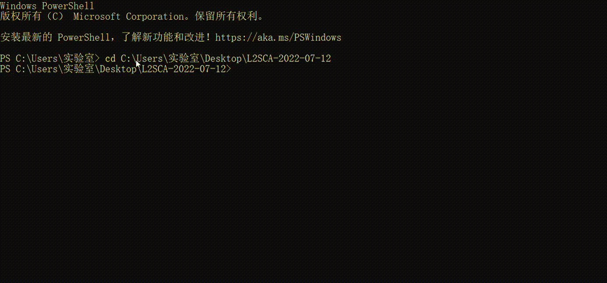

# NeoSCA

[](https://github.com/tanloong/neosca/actions?query=workflow%3Abuild)
[](https://github.com/tanloong/neosca/actions?query=workflow%3ALint)
[](https://codecov.io/gh/tanloong/neosca)
[](https://www.codacy.com/gh/tanloong/neosca/dashboard?utm_source=github.com&amp;utm_medium=referral&amp;utm_content=tanloong/neosca&amp;utm_campaign=Badge_Grade)
[](https://pypi.org/project/neosca)
[](https://github.com/tanloong/neosca/commits/master)


[](https://pepy.tech/project/neosca)
[](https://github.com/tanloong/neosca/blob/master/LICENSE.txt)

<!--  -->

简体中文 |
[繁體中文](https://github.com/tanloong/neosca/blob/master/README_zh_tw.md) |
[English](https://github.com/tanloong/neosca#readme)

NeoSCA 是 [Xiaofei Lu](http://personal.psu.edu/xxl13/index.html) 的 [L2 Syntactic Complexity Analyzer (L2SCA)](http://personal.psu.edu/xxl13/downloads/l2sca.html) 的复刻版，添加了对 Windows 的支持和更多的命令行选项，作者谭龙。NeoSCA 对英文语料统计以下内容：

<details>

<summary>
9 种句法结构的频次
</summary>

1. 单词
2. 句子
3. 动词短语
4. 子句
5. T 单位
6. 从属子句
7. 复杂 T 单位
8. 并列短语
9. 复杂名词性短语

</details>

<details>

<summary>
14 种句法复杂度指标的值
</summary>

1. 平均句子长度
2. 平均 T 单位长度
3. 平均子句长度
4. 每个句子中子句的数量
5. 每个 T 单位中的动词短语数量
6. 每个 T 单位中的子句数量
7. 从属子句比率，即每个子句中的从属子句数量
8. 每个 T 单位中的从属子句数量 
9. 并列句比率，即每个句子中的 T 单位数量
10. 复杂 T 单位比率，即每个 T 单位中的复杂 T 单位数量
11. 每个 T 单位中的并列短语数量
12. 每个子句中的并列短语数量
13. 每个 T 单位中的复杂名词性短语数量
14. 每个子句中的复杂名词性短语数量

</details>

<a name="readme-top"></a>

## 目录

<!-- vim-markdown-toc GFM -->

* [Highlights](#highlights)
* [安装](#安装)
* [使用](#使用)
    * [基本使用](#基本使用)
    * [进阶使用](#进阶使用)
    * [其他](#其他)
* [引用](#引用)
* [类似软件](#类似软件)
* [许可证](#许可证)
* [联系](#联系)

<!-- vim-markdown-toc -->

## Highlights

* 跨平台：支持 **Windows**、macOS 和 Linux 系统。
* 灵活的命令行选项
* 支持 txt/docx/odt 格式的输入文件
* 统计自定义句法结构

## 安装

### 安装 NeoSCA

要安装 NeoSCA，你需要在电脑上安装 Python 3.7 或更高版本。你可以在终端中运行以下命令来检查是否已安装 Python：

```sh
python --version
```

如果未安装 Python，则可以从 [Python 官网](https://www.python.org/downloads/) 下载并安装。安装了 Python 后，可以使用 pip 安装 NeoSCA：

```sh
pip install neosca
```

国内用户可以从镜像网站下载：

```sh
pip install neosca -i https://pypi.tuna.tsinghua.edu.cn/simple
```

### 安装依赖

运行 NeoSCA 需要 [Java](https://www.java.com/en/download/manual.jsp) 8 或更高版本、[Stanford Parser](https://nlp.stanford.edu/software/lex-parser.shtml) 和 [Stanford Tregex](https://nlp.stanford.edu/software/tregex.html)。NeoSCA 提供了安装这些依赖的选项：

```sh
nsca --check-depends
```

运行上面这条命令，NeoSCA 会将依赖的压缩包下载并解压到 `%AppData%` (Windows；`C:\\Users\\<username>\\AppData\\Roaming`) 或者 `~/.local/share` (macOS 和 Linux)，然后设置 3 个环境变量 `JAVA_HOME`、`STANFORD_PARSER_HOME` 和 `STANFORD_TREGEX_HOME`。**如果你之前已经下载过某个/某些依赖，需要手动设置对应的环境变量。**

## 使用

NeoSCA 是通过命令行来使用的。在终端中输入 `nsca --help` 加回车可以查看它的帮助信息。

### 基本使用

#### 单个输入文件

在终端中输入 `nsca` 加空格，后面跟输入文件的路径。

```sh
nsca ./samples/sample1.txt
nsca ./samples/sample1.docx
```

docx/odt 文件需要事先删除表格、图表、图片等不相关元素，页眉页脚会自动忽略，不必删除 (若有)。

输出文件会保存在当前路径下，默认文件名是 `result.csv`，使用 `-o/--output-file` 可以自定义输出文件名。

```sh
nsca ./samples/sample1.txt -o sample1.csv
# 输出文件: ./sample1.csv
```

<details>

<summary>
如果输入文件的路径包含空格，需要将它用单引号或双引号包裹。比如分析 <code>sample 1.txt</code> 应该用：
</summary>

```sh
nsca "./samples/sample 1.txt"
```

这可以让包括空格在内的整个路径被识别为单个输入文件，否则 “./samples/sample” 和 “1.txt” 会被认为是两个文件，因为这两个文件都不存在，所以程序会运行失败。

</details>

#### 多个输入文件

在 `nsca` 的右边指定输入文件夹。

```
nsca samples/              # 分析 samples/ 文件夹下所有的 txt 和 docx 文件
nsca samples/ --ftype txt  # 只分析 txt 文件
nsca samples/ --ftype docx # 只分析 docx 文件
```

或者以空格为间隔列出输入文件：

```sh
cd ./samples/
nsca sample1.txt sample2.txt
```

或者使用 [通配符](https://www.gnu.org/savannah-checkouts/gnu/clisp/impnotes/wildcard.html#wildcard-syntax)：

```sh
cd ./samples/
nsca sample*.txt                                           # 指定所有文件名以 “sample” 开头并且以 “.txt” 结尾的文件
nsca sample[1-9].txt sample10.txt                          # sample1.txt -- sample10.txt
nsca sample10[1-9].txt sample1[1-9][0-9].txt sample200.txt # sample101.txt -- sample200.txt
```

### 进阶使用

#### 展开通配符

如果你要检验输入的通配符是否匹配且只匹配到想要分析的文件，可以使用 `--expand-wildcards` 来显示通配符的展开结果。注意这只会显示存在的文件，如果展开范围里的某个文件并不存在，那么它不会显示在展开结果里。

```sh
nsca sample10[1-9].txt sample1[1-9][0-9].txt sample200.txt --expand-wildcards
```

#### 将换行符作为句子边界

NeoSCA 所调用的 Stanford Parser 在分句时，默认不会把换行符当作句子边界。要实现这个效果可以用：

```sh
nsca sample1.txt --newline-break always
```

`--newline-break` 有 3 个可选值：`never` (默认)、`always` 和 `two`。

+ `never` 表示在分句时忽略换行符，只使用非空白字符来确定句子边界，适用于存在句内换行的文本。
+ `always` 表示将换行符作为句子边界，但两个换行符之间仍可以有多个句子。
+ `two` 表示将连续的两个 (或更多) 换行符作为句子边界，适用于存在句内换行、段落之间以空行间隔的文本。

#### 配置文件

你可以使用配置文件来自定义需要统计/计算的句法结构。

neosca 的默认配置文件名为 `nsca.json`，neosca 会尝试在当前工作目录查找 `nsca.json`。你可以使用命令 `nsca --config <your_config_file>` 指定自己的配置文件。配置文件应为 JSON 格式，并以 `.json` 扩展名命名。

```json
{
    "structures": [
        {
            "name": "VP1",
            "description": "regular verb phrases",
            "tregex_pattern": "VP > S|SINV|SQ"
        },
        {
            "name": "VP2",
            "description": "verb phrases in inverted yes/no questions or in wh-questions",
            "tregex_pattern": "MD|VBZ|VBP|VBD > (SQ !< VP)"
        },
        {
            "name": "VP",
            "description": "verb phrases",
            "value_source": "VP1 + VP2"
        }
    ]
}
```

上面是 neosca 内置的句法结构定义的一部分。定义应遵循键值对的格式，其中键和值都应放在半角引号中。

neosca 提供了两种定义句法结构的方法：使用 `tregex_pattern` 或 `value_source`。`tregex_pattern` 是基于 Tregex 语法的定义。通过 `tregex_pattern` 定义的句法结构，会运行 Stanford Tregex 来统计频次。关于 Tregex pattern 要怎么写，请查看：

+ Xiaofei 的 [*Computational Methods for Corpus Annotation and Analysis*](http://www.springer.com/education+%26+language/linguistics/book/978-94-017-8644-7?otherVersion=978-94-017-8645-4) 的第六章
+ 一位 Galen Andrew 的 [PPT](https://nlp.stanford.edu/software/tregex/The_Wonderful_World_of_Tregex.ppt)
+ [TregexPattern 文档](http://nlp.stanford.edu/nlp/javadoc/javanlp/edu/stanford/nlp/trees/tregex/TregexPattern.html)

`value_source` 表示该句法结构通过对其他结构的值做算术运算来间接统计。`value_source` 可以包含其他结构的 `name`、整数、小数、`+`、`-`、`*`、`/`、半角括号 `(` 和 `)`。`value_source` 的分词用的是 Python 的标准库 tokenize，这个库是专门针对 Python 源代码的，如果一个句法结构需要在其他结构的 `value_source` 里被引用，确保它的 `name` 符合 Python 变量的命名规则 (由字母、数字、下划线组成，不能以数字开头；字母指 Unicode 字符集中 Letter 分类的字符，比如英文字母、汉字等)，否则会识别错误。

`value_source` 的定义可以嵌套，依赖结构自身也可以通过 `value_source` 来定义并依赖于其他结构，形成类似树的关系。但位于叶子节点的句法结构必须通过 `tregex_pattern` 来定义，避免定义循环。

定义一个句法结构时只能使用 `tregex_pattern` 或 `value_source` 的其中一种，不能两个同时使用。`name` 的值可以在 `--select` 选项中使用。`description` 可以不写。

#### 选取部分指标

NeoSCA 默认计算所有指标的值，使用 `--select` 可以只计算选定指标的值。要查看所有的可选指标可以用 `nsca --list`。

```sh
nsca --select VP T DC/C -- sample1.txt
```

注意需要使用 `--` 将选定指标与输入文件名区分开。`--` 右边的所有参数都将被视为输入文件名，请确保将输入文件名之外的参数写在 `--` 的左边。

#### 合并子文件

使用 `-c`/`--combine-subfiles` 选项可以累加子文件中 9 种句法结构的频次并计算原文件的 14 种句法复杂度指标的值。你可以使用多个 `-c` 来分别合并不同的子文件列表。命令中同时含有输入子文件名和输入文件名时需要使用 `--` 把二者区分开。

```sh
nsca -c sample1-sub1.txt sample1-sub2.txt
nsca -c sample1-sub*.txt
nsca -c sample1-sub*.txt -c sample2-sub*.txt
nsca -c sample1-sub*.txt -c sample2-sub*.txt -- sample[3-9].txt
```

#### 跳过长句子

使用 `--max-length` 选项来只分析不超过 (≤) 特定长度的句子。

```sh
nsca sample1.txt --max-length 100
```

当没有指定 `--max-length` 时，NeoSCA 会分析所有句子，但可能会导致[内存超出限制](https://nlp.stanford.edu/software/parser-faq.html#k)。

#### 保存中间结果

<details>

<summary>
NeoSCA 默认只保存各指标的计算结果，如果要保存对输入文件进行短语结构分析得到的句法树，请使用 <code>-p</code> 或 <code>--reserve-parsed</code>。如果要保存查找句法树时得到的符合对应句法结构的子树，请使用 <code>-m</code> 或 <code>--reserve-matched</code>。
</summary>

```sh
nsca samples/sample1.txt -p
# 频次结果: ./result.csv
# 句法树:     ./samples/sample1.parsed
nsca samples/sample1.txt -m
# 频次结果: ./result.csv
# 查找到的子树: ./result_matches/
nsca samples/sample1.txt -p -m
# 频次结果: ./result.csv
# 句法树:     ./samples/sample1.parsed
# 查找到的子树: ./result_matches/
```

</details>

### 其他

#### 从命令行传入文本

要直接从命令行传入文本可以使用 `--text`。

```sh
nsca --text 'The quick brown fox jumps over the lazy dog.'
# 输出结果: ./result.csv
```

#### 输出 JSON 文件

要输出 JSON 格式的文件可以通过以下方式：

```sh
nsca ./samples/sample1.txt --output-format json
# 输出结果: ./result.json
nsca ./samples/sample1.txt -o sample1.json
# 输出结果: ./sample1.json
```

#### 只做句法分析

如果你不需要各指标的计算结果，只需要得到短语结构句法树用于其他用途，可以使用 `--no-query`，NeoSCA 会只对输入文件做短语结构分析并保存得到的句法树，跳过后续查找句法树的环节。

```sh
nsca samples/sample1.txt --no-query
# 句法树: samples/sample1.parsed
nsca --text 'This is a test.' --no-query
# 句法树: ./cmdline_text.parsed
```

#### 将成分句法树作为输入

NeoSCA 默认接受原始文本作为输入，对文本进行短语结构分析并生成句法树，然后统计句法树中的目标句法结构。使用 `--no-parse` 可以让程序跳过短语结构分析的步骤，直接将输入文件作为句法树开始统计的步骤。使用此选项时，`is_skip_querying` 和 `reserve_parsed` 会自动设置为 False。

```sh
nsca samples/sample1.parsed --no-parse
```

#### 列出内置指标

<details>

<summary>
<code>nsca --list</code>
</summary>

```sh
W: words
S: sentences
VP: verb phrases
C: clauses
T: T-units
DC: dependent clauses
CT: complex T-units
CP: coordinate phrases
CN: complex nominals
MLS: mean length of sentence
MLT: mean length of T-unit
MLC: mean length of clause
C/S: clauses per sentence
VP/T: verb phrases per T-unit
C/T: clauses per T-unit
DC/C: dependent clauses per clause
DC/T: dependent clauses per T-unit
T/S: T-units per sentence
CT/T: complex T-unit ratio
CP/T: coordinate phrases per T-unit
CP/C: coordinate phrases per clause
CN/T: complex nominals per T-unit
CN/C: complex nominals per clause
```

</details>

#### Tregex 接口

使用 `nsca-tregex` 可以在命令行下运行 Tregex，该命令和 Tregex package 中的 `tregex.sh` 功能类似，但额外支持 Windows。

#### 词法复杂度分析

使用 `nsca-lca` 命令可以分析输入文本的词法复杂度，功能与 [LCA (Lexical Complexity Analyzer)](https://sites.psu.edu/xxl13/lca/) 相同，指标如下：

<!-- {{{ LCA measures -->
<details>
<summary>
Measures of Lexical Density and Sophistication
</summary>

|Measure|Formula|
|-|-|
|Lexical Density||
|Lexical Sophistication-I||
|Lexical Sophistication-II||
|Verb Sophistication-I||
|Corrected Verb Sophistication-I||
|Verb Sophistication-II||

</details>

<details>
<summary>
Measures of Lexical Variation
</summary>

|Measure|Formula|
|-|-|
|Number of Different Words||
|Number of Different Words (first 50 words)||
|Number of Different Words (expected random 50)||
|Number of Different Words (expected sequence 50)||
|Type-Token Ratio||
|Mean Segmental Type-Token Ratio (50)||
|Corrected Type-Token Ratio||
|Root Type-Token Ratio||
|Bilogarithmic Type-Token Ratio||
|Uber Index||
|Lexical Word Variation||
|Verb Variation-I||
|Squared Verb Variation-I||
|Corrected Verb Variation-I||
|Verb Variation-II||
|Noun Variation||
|Adjective Variation||
|Adverb Variation||
|Modifier Variation| types to the number of lexical words")|

</details>
<!-- }}} -->

```sh
nsca-lca sample.txt # 单篇分析
nsca-lca samples/   # 批量分析
```

## 引用

如果你在发表的成果中使用了 NeoSCA，请按如下信息进行引用。

<details>

<summary>
BibTeX
</summary>

```BibTeX
@misc{tan2022neosca,
title        = {NeoSCA: A Fork of L2 Syntactic Complexity Analyzer, version 0.0.53},
author       = {Long Tan},
howpublished = {\url{https://github.com/tanloong/neosca}},
year         = {2022}
}
```

</details>

<details>

<summary>
APA (7th edition)
</summary>

<pre>Tan, L. (2022). <i>NeoSCA</i> (version 0.0.53) [Computer software]. Github. https://github.com/tanloong/neosca</pre>

</details>

<details>

<summary>
MLA (9th edition)
</summary>

<pre>Tan, Long. <i>NeoSCA</i>. version 0.0.53, GitHub, 2022, https://github.com/tanloong/neosca.</pre>

</details>

同时，你也需要引用 Xiaofei 介绍 L2SCA 的文章：

<details>

<summary>
BibTeX
</summary>

```BibTeX
@article{xiaofei2010automatic,
title     = {Automatic analysis of syntactic complexity in second language writing},
author    = {Xiaofei Lu},
journal   = {International journal of corpus linguistics},
volume    = {15},
number    = {4},
pages     = {474--496},
year      = {2010},
publisher = {John Benjamins Publishing Company},
doi       = {10.1075/ijcl.15.4.02lu},
}
```

</details>

<details>

<summary>
APA (7th edition)
</summary>

<pre>Lu, X. (2010). Automatic analysis of syntactic complexity in second language writing. <i>International Journal of Corpus Linguistics, 15</i>(4), 474-496.</pre>

</details>

<details>

<summary>
MLA (9th edition)
</summary>

<pre>Lu, Xiaofei. "Automatic Analysis of Syntactic Complexity in Second Language Writing." <i>International Journal of Corpus Linguistics</i>, vol. 15, no. 4, John Benjamins Publishing Company, 2010, pp. 474-96.</pre>

</details>

如果你使用了词法复杂度的功能，请引用 Xiaofei 关于 LCA 的文章。

<details>

<summary>
BibTeX
</summary>

```BibTeX
@article{xiaofei2012relationship,
author  = {Xiaofei Lu},
title   = {The Relationship of Lexical Richness to the Quality of ESL Learners' Oral Narratives},
journal = {The Modern Language Journal},
volume  = {96},
number  = {2},
pages   = {190-208},
doi     = {https://doi.org/10.1111/j.1540-4781.2011.01232\_1.x},
year    = {2012}
}
```

</details>

<details>

<summary>
APA (7th edition)
</summary>

<pre>Lu, X. (2012). The relationship of lexical richness to the quality of ESL learners' oral narratives. <i>The Modern Language Journal, 96</i>(2), 190-208.</pre>

</details>

<details>

<summary>
MLA (9th edition)
</summary>

<pre>Lu, Xiaofei. "The Relationship of Lexical Richness to the Quality of ESL Learners' Oral Narratives." <i>The Modern Language Journal</i>, vol. 96, no. 2, Wiley-Blackwell, 2012, pp. 190-208.</pre>

</details>

## 相关软件

+ [L2SCA](https://sites.psu.edu/xxl13/l2sca/) 原版，使用的是 Python，作者 [Xiaofei Lu](https://sites.psu.edu/xxl13)
+ [L2SCA online](https://aihaiyang.com/software/l2sca/)，作者 [Haiyang Ai](https://aihaiyang.com/)
+ [TAASSC](https://www.linguisticanalysistools.org/taassc.html)，使用的是 Python，作者 [Kristopher Kyle]( https://kristopherkyle.github.io/professional-webpage/)
+ [L2SCA R 语言版](https://pennstateoffice365-my.sharepoint.com/personal/xxl13_psu_edu/_layouts/15/onedrive.aspx?id=%2Fpersonal%2Fxxl13%5Fpsu%5Fedu%2FDocuments%2Fother%2Dwork%2Fwebpage%2Fdownloads%2FL2SCA%5FR%2Ezip&parent=%2Fpersonal%2Fxxl13%5Fpsu%5Fedu%2FDocuments%2Fother%2Dwork%2Fwebpage%2Fdownloads&ga=1)，作者 [Thomas Gaillat](https://perso.univ-rennes2.fr/thomas.gaillat)、Anas Knefati 和 Antoine Lafontaine
+ [FSCA](https://github.com/nvandeweerd/fsca) (法语句法复杂度分析器)，使用的是 R 语言，作者 [Nate Vandeweerd](https://github.com/nvandeweerd)

## 许可证

根据 [GNU 通用公共许可证第 2 版](https://github.com/tanloong/neosca/blob/master/LICENSE.txt) 或更高版本的条款分发。

## 联系

你可以通过以下方式发送错误报告、功能请求或任何问题：

+ [GitHub Issues](https://github.com/tanloong/neosca/issues)
+ tanloong@foxmail.com
